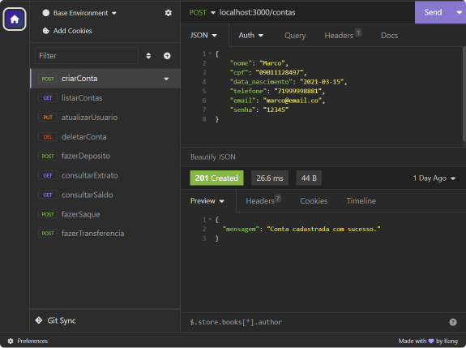

# API Sistema Financeiro

Este é um projeto com fins acadêmicos que faz a simulação de um sistema financeiro, e possui funcionalidades referentes a dois conjuntos de operações: CRUD de usuário e Operações de conta.


## Screenshots




## Funcionalidades

- CRUD de usuário
    - cadastro
    - leitura
    - atualização
    - exclusão
- Operações de conta
    - depósito
    - saque
    - transferência
    - consulta de saldo
    - consulta de extrato


## Rodando localmente

Clone o projeto

```bash
  git clone https://github.com/marriett/backend-sistema-financeiro.git
```

Entre no diretório do projeto

```bash
  cd backend-sistema-financeiro
```

Instale as dependências

```bash
  npm install
```

Inicie o servidor

```bash
  npm run dev
```


## Documentação da API
__Atenção__: nesta versão do projeto, o objetivo da API é de executar as funções salvando seus dados apenas em memória. O que implica dizer que todos os usuários, contas e movimentações feitas durante seu teste, existem apenas durante o ciclo de execução do servidor, e são apagadas da memória sempre que esta execução do servidor for interrompida ou reiniciada.

### Operações de CRUD de usuário

#### Retorna todos os usuários cadastrados

```http
  GET /contas?senha=motherlode
```

| Parâmetro   | Tipo       | Descrição                           |
| :---------- | :--------- | :---------------------------------- |
| `senha` | `string` | **Obrigatório**. A chave da API (`motherlode` é o padrão) |

#### Cadastra novo usuário

```http
  POST /contas
```

| Parâmetro   | Tipo       | Descrição                                   |
| :---------- | :--------- | :------------------------------------------ |
| `nome`      | `string` | **Obrigatório**. O Nome do usuário que você quer cadastrar |
| `cpf`      | `string` | **Obrigatório e único**. O Número de cpf do usuário (deve conter exatamente 11 dígitos) |
| `data_nascimento`      | `string` | **Obrigatório**. Data de nascimento do usuário, no formato `aaaa-mm-dd` |
| `telefone`      | `string` | **Obrigatório**. O telefone de contato do usuário |
| `email`      | `string` | **Obrigatório e único**. O endereço de e-mail do usuário |
| `senha`      | `string` | **Obrigatório**. A senha de acesso ao sistema para o usuário |

#### Atualização de dados do usuário

```http
  PUT /contas/:numero_conta/usuario
```

| Parâmetro   | Tipo       | Descrição                                   |
| :---------- | :--------- | :------------------------------------------ |
| `nome`      | `string` | **Obrigatório**. O Novo nome do usuário que você quer atualizar |
| `cpf`      | `string` | **Obrigatório e único**. O Número de cpf do usuário (deve conter exatamente 11 dígitos) |
| `data_nascimento`      | `string` | **Obrigatório**. Data de nascimento do usuário, no formato `aaaa-mm-dd` |
| `telefone`      | `string` | **Obrigatório**. O telefone de contato do usuário |
| `email`      | `string` | **Obrigatório e único**. O endereço de e-mail do usuário |
| `senha`      | `string` | **Obrigatório**. A senha de acesso ao sistema para o usuário |

#### Deletar usuário

```http
  DELETE /contas/:numero_conta
```

### Operações de conta

#### Fazer depósito

```http
  POST /transacoes/depositar
```

| Parâmetro   | Tipo       | Descrição                                   |
| :---------- | :--------- | :------------------------------------------ |
| `numero_conta`      | `string` | **Obrigatório**. O número da conta em que será feito o depósito |
| `valor`      | `int` | **Obrigatório**. O valor a ser depositado, o número deve ser informado em centavos |

#### Realizar saque

```http
  POST /transacoes/sacar
```

| Parâmetro   | Tipo       | Descrição                                   |
| :---------- | :--------- | :------------------------------------------ |
| `numero_conta`      | `string` | **Obrigatório**. O número da conta em que será realizado o sque |
| `valor`      | `int` | **Obrigatório**. O valor a ser sacado, o número deve ser informado em centavos |
| `senha`      | `string` | **Obrigatório**. A senha de acesso do usuário correspondente à conta informada |

#### Realizar transferência de valores

```http
  POST /transacoes/transferir
```

| Parâmetro   | Tipo       | Descrição                                   |
| :---------- | :--------- | :------------------------------------------ |
| `numero_conta_origem`      | `string` | **Obrigatório**. O número da conta que irá realizar a transferência |
| `numero_conta_destino`      | `string` | **Obrigatório**. O número da conta que será favorecida pela transferência |
| `valor`      | `int` | **Obrigatório**. O valor a ser transferido, o número deve ser informado em centavos |
| `senha`      | `string` | **Obrigatório**. A senha de acesso do usuário correspondente à conta de origem (`numero_conta_origem`) |

#### Consultar saldo em conta

```http
  GET /contas/saldo?numero_conta=1&senha=12345
```
| Parâmetro   | Tipo       | Descrição                                   |
| :---------- | :--------- | :------------------------------------------ |
| `numero_conta`      | `string` | **Obrigatório**. O número da conta a ser consultado o saldo |
| `senha`      | `string` | **Obrigatório**. A senha de acesso do usuário correspondente à conta informada |

#### Consultar extrato em conta

```http
  GET /contas/extrato?numero_conta=1&senha=12345
```
| Parâmetro   | Tipo       | Descrição                                   |
| :---------- | :--------- | :------------------------------------------ |
| `numero_conta`      | `string` | **Obrigatório**. O número da conta a ser consultado o extrato |
| `senha`      | `string` | **Obrigatório**. A senha de acesso do usuário correspondente à conta informada |


## Aprendizados

O projeto foi construído como atividade avaliatória da Unidade II do curso de Desenvolvimento de Software Backend da Cubos Academy.
Nesta unidade foram abordados os conceitos de Servidores, Rotas e APIs.

Para tornar a API funcional, foram aplicados conceitos como Arquitetura REST, manipulação de Strings, Arrays e Objetos, conversão e tratamento de dados.

Este projeto serviu não apenas para fixar os conceitos apresentados na Unidade II, como configuração de servidores e criação de rotas, mas também para relacioná-los a toda a base  lógica aprendida anteriormente no curso. 


## Stack utilizada

**Back-end:** JavaScript, Node, Express, Rest


## Licença

[MIT](https://choosealicense.com/licenses/mit/)

